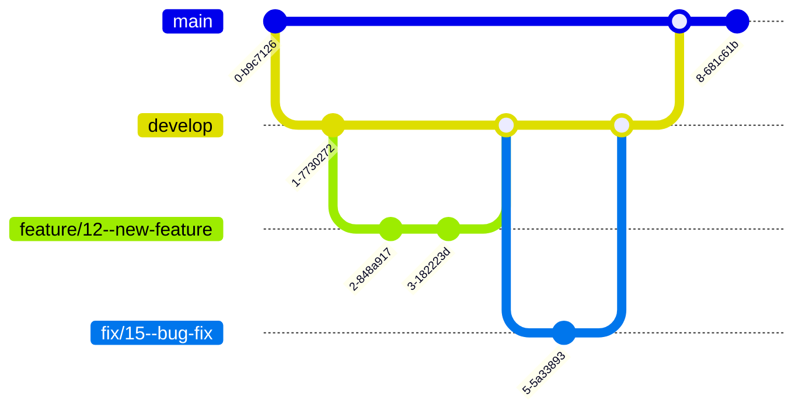

# 🌿 Git 브랜치 전략 및 명명 규칙 (Branching Convention)

프로젝트의 개발 흐름을 체계적으로 관리하고, 배포 및 병합 과정을 명확히 하기 위해 Git Flow를 간소화한 브랜치 전략을 사용합니다.

### 1. 브랜치 전략 (Simplified Git Flow)

- **배포(Production)**: `main` 브랜치
- **개발(Development)**: `develop` 브랜치 (모든 기능 개발의 기반)
- **작업 브랜치**: `develop`에서 분기하며, 작업 완료 후 `develop`으로 병합됩니다.

## 1.1. 브랜치 흐름 시각화

### 2. 브랜치 명명 규칙

## 2.1. 명명 형식

브랜치 이름은 소문자, 하이픈(-)을 사용하며, 타입, 이슈 번호, 기능명 순서로 명확하게 구분합니다.

형식: <Type>/<이슈번호>—<기능명>

구분자: 이슈 번호와 기능명은 **이중 하이픈(—)**으로 구분합니다.

기능명: 간결하고 명확한 영어로 작성하며, 단어는 하이픈(-)으로 연결합니다.

#####################################################################################################

# Type, 명명 규칙, 설명, 예시

- feature,feature/<이슈번호>—<기능명>,새로운 기능을 개발하는 브랜치,feature/12--implement-wishlist

- fix,fix/<이슈번호>—<버그명>,버그를 수정하는 브랜치,fix/12--close-modal-bug

- refactor,refactor/<이슈번호>—<리팩토링명>,코드 리팩토링 브랜치,refactor/12--restructure-components

- style,style/<이슈번호>—<스타일수정작업명>,"코드 포맷팅, 스타일 수정",style/12--apply-eslint-fixes

- docs,docs/<이슈번호>—<문서작업명>,"문서 수정 (README, CONVENTION 등)",docs/12--add-api-documentation

- chore,chore/<이슈번호>—<수정작업명>,"빌드, 패키지 매니저 설정 등",chore/13--configure-env-variables

- perf,perf/<이슈번호>—<성능개선작업명>,성능 개선 작업,perf/20--optimize-loading

- build,build/<이슈번호>—<빌드작업명>,빌드 관련 파일 수정,build/12--optimize-vite-settings

- ci,ci/<이슈번호>—<ci작업명>,CI 설정 파일 수정,ci/20--add-workflow

#####################################################################################################

### 3. 브랜치 워크플로우 (Working Process)

모든 작업은 최신 develop 브랜치를 기반으로 합니다.

## 3.1. 작업 시작

# develop 브랜치로 이동 및 최신 상태 pull

git switch develop
git pull

# 작업 브랜치 생성 및 이동

git switch -c feature/17--implement-dark-mode
git push -u origin feature/17--implement-dark-mode

## 3.2. 작업 완료 및 PR 준비

# 작업 완료 후 커밋 (COMMIT.md 컨벤션 준수)

git add .
git commit -m "feat: 다크 모드 구현(#17)"

# 원본 develop 기준으로 리베이스 (충돌 해결)

git switch develop
git pull
git switch feature/17--implement-dark-mode
git rebase develop

# 원격 저장소에 푸시 (리베이스 시 force-push 필요)

git push

# GitHub에서 develop 브랜치로 Pull Request 생성
